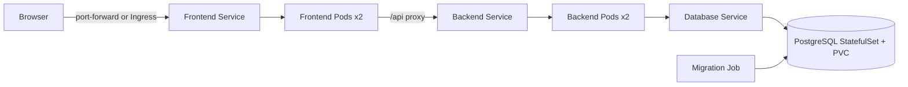

# Kubernetes Todo Lab — преподавательское решение

[Русский](README.md) | [English](README_EN.md)

Практический проект по развёртыванию трёхуровневого приложения в локальном
Kubernetes. Пользователь создаёт, отмечает и удаляет задачи; данные сохраняются
в PostgreSQL.

> Это готовое reference solution для преподавателя. Студентам выдаётся отдельный
> repository `kubernetes-todo-starter` без Docker и Kubernetes implementation.

## Как выглядит приложение


Приложение имеет адаптивный интерфейс для создания, выполнения и удаления задач.
Все изменения сохраняются в PostgreSQL.

### FastAPI documentation


## Стек

- React 19, Vite 8 и Nginx — frontend;
- Python 3.11 и FastAPI — backend REST API;
- PostgreSQL 16 — database;
- Docker и Docker Compose — проверка containers;
- Kubernetes — Deployments, StatefulSet, Services, Job, ConfigMap, Secret, PVC,
  probes, resources, RBAC, NetworkPolicy, Ingress и HPA;
- kind или Minikube — локальный cluster;
- Helm — необязательно.

## Архитектура



## Быстрая проверка через Docker Compose

```bash
docker compose up --build -d
docker compose ps
curl http://localhost:8081/api/items/
```

Откройте <http://localhost:8081>. Остановка:

```bash
docker compose down
docker compose down --volumes  # также удалить локальные данные
```

## Запуск в Minikube

Требуются Docker, `kubectl` и Minikube. Перед запуском остановите Compose через
`docker compose down`, чтобы освободить порт `8081`.

```bash
minikube start -p todo-lab --driver=docker
minikube image build -p todo-lab -t todo-backend:local ./backend
minikube image build -p todo-lab -t todo-frontend:local ./frontend
```

Можно использовать kind вместо Minikube. В таком случае соберите images через
Docker и загрузите их командой `kind load docker-image`.

Создайте namespace, configuration и Secret. Пароль ниже предназначен только для
локального disposable cluster и не сохраняется в Git:

```bash
kubectl apply -f kubernetes/namespace.yml
kubectl apply -f kubernetes/configmap.yml
kubectl -n kubernetes-todo create secret generic todo-database \
  --from-literal=POSTGRES_PASSWORD='local-cluster-password'
```

Запустите database и миграцию:

```bash
kubectl apply -f kubernetes/database.yml
kubectl -n kubernetes-todo rollout status statefulset/database
kubectl apply -f kubernetes/database-migration-job.yml
kubectl -n kubernetes-todo wait --for=condition=complete job/database-migration --timeout=180s
```

Запустите application workloads:

```bash
kubectl apply -f kubernetes/backend.yml
kubectl apply -f kubernetes/frontend.yml
kubectl apply -f kubernetes/rbac.yml
kubectl apply -f kubernetes/network-policy.yml
kubectl -n kubernetes-todo rollout status deployment/backend
kubectl -n kubernetes-todo rollout status deployment/frontend
kubectl -n kubernetes-todo get pods,services,pvc
```

Откройте приложение:

```bash
kubectl -n kubernetes-todo port-forward service/frontend 8081:8080
```

Затем перейдите на <http://localhost:8081>. API docs доступны по
<http://localhost:8081/api/docs>.

## Дополнительные компоненты

- `ingress.yml` применяется после установки NGINX Ingress Controller;
- `hpa.yml` требует Metrics Server;
- Helm не обязателен и application chart намеренно отсутствует.

```bash
kubectl apply -f kubernetes/ingress.yml
kubectl apply -f kubernetes/hpa.yml
kubectl auth can-i list pods \
  --as=system:serviceaccount:kubernetes-todo:todo-viewer \
  -n kubernetes-todo
```

## Что проверяет преподаватель

- две Ready replicas frontend и backend;
- ClusterIP Services и Kubernetes DNS;
- ConfigMap отдельно от Secret;
- database persistence через PVC;
- readiness/liveness probes и resource limits;
- Job завершил Alembic migration;
- удалённый Pod автоматически восстановился;
- rollout history и rollback;
- RBAC разрешает только чтение;
- приложение сохраняет данные после restart Pod.

## Cleanup

```bash
minikube delete -p todo-lab
```

## Происхождение

Application code основан на открытом проекте
[`fif911/kubernetes-front-end-backend-example`](https://github.com/fif911/kubernetes-front-end-backend-example)
под Apache License 2.0. Учебная упаковка, manifests, security defaults,
healthchecks, dependency pins и документация переработаны. См. `NOTICE` и
`LICENSE`.
