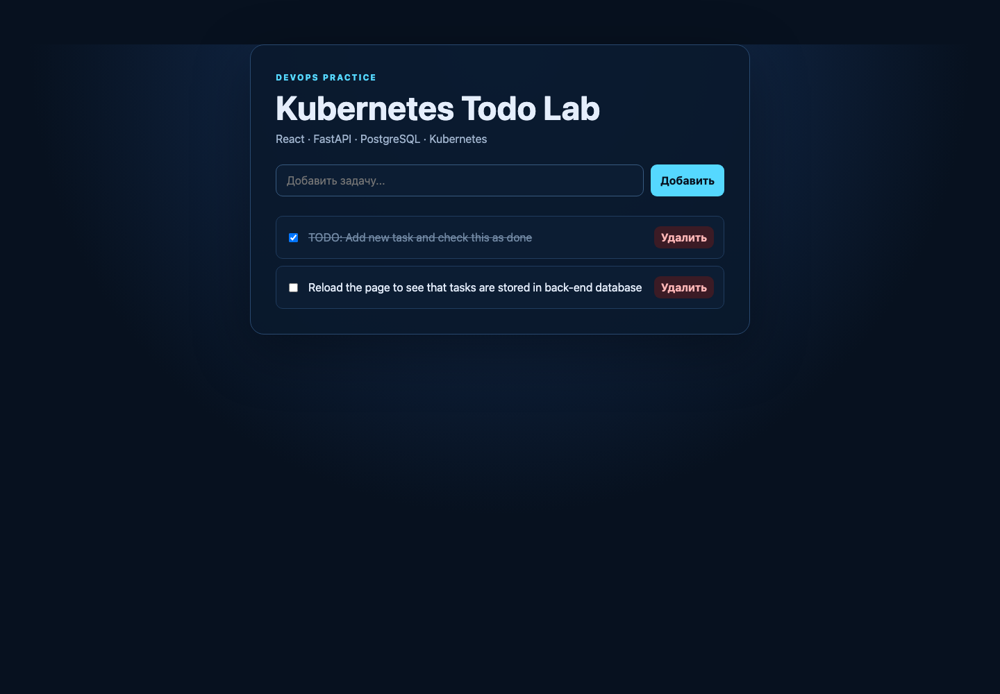
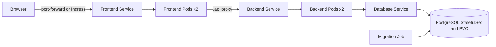

# Kubernetes Todo — Teacher Reference

[Русский](README.md) | [English](README_EN.md)

Kubernetes Todo Lab is a hands-on project for deploying a three-tier application
to a local Kubernetes cluster. Users can create, complete, and delete tasks, and
PostgreSQL provides persistent storage.

> This is the instructor reference solution. Students should receive the
> separate `kubernetes-todo-student` repository without ready-made Docker or
> Kubernetes implementation files.

## Application preview



### FastAPI documentation


## Stack

- React 19 and Vite 8;
- unprivileged Nginx frontend;
- Python 3.11 and FastAPI backend;
- PostgreSQL 16;
- Docker and Docker Compose;
- Kubernetes Deployments, StatefulSet, Services, Job, ConfigMap, Secret, PVC,
  probes, resources, RBAC, NetworkPolicy, optional Ingress, and optional HPA;
- Minikube or kind;
- optional Helm.

## Architecture



## Docker Compose quick start

```bash
docker compose up --build -d
docker compose ps
curl http://localhost:8081/api/items/
```

Open <http://localhost:8081>. Stop the stack with `docker compose down`; add
`--volumes` only when you also want to delete local PostgreSQL data.

## Deploy to Minikube

Install Docker, `kubectl`, and Minikube. Stop Compose first to release port
`8081`.

```bash
minikube start -p todo-lab --driver=docker
minikube image build -p todo-lab -t todo-backend:local ./backend
minikube image build -p todo-lab -t todo-frontend:local ./frontend
```

Create configuration and a local-only Secret:

```bash
kubectl apply -f kubernetes/namespace.yml
kubectl apply -f kubernetes/configmap.yml
kubectl -n kubernetes-todo create secret generic todo-database \
  --from-literal=POSTGRES_PASSWORD='local-cluster-password'
```

Deploy PostgreSQL and run migrations:

```bash
kubectl apply -f kubernetes/database.yml
kubectl -n kubernetes-todo rollout status statefulset/database
kubectl apply -f kubernetes/database-migration-job.yml
kubectl -n kubernetes-todo wait --for=condition=complete \
  job/database-migration --timeout=180s
```

Deploy the application and security resources:

```bash
kubectl apply -f kubernetes/backend.yml
kubectl apply -f kubernetes/frontend.yml
kubectl apply -f kubernetes/rbac.yml
kubectl apply -f kubernetes/network-policy.yml
kubectl -n kubernetes-todo rollout status deployment/backend
kubectl -n kubernetes-todo rollout status deployment/frontend
kubectl -n kubernetes-todo get pods,services,pvc,jobs
```

Open the application:

```bash
kubectl -n kubernetes-todo port-forward service/frontend 8081:8080
```

Visit <http://localhost:8081>. API documentation is available at
<http://localhost:8081/api/docs>.

## Optional components

- `kubernetes/ingress.yml` requires an NGINX Ingress Controller;
- `kubernetes/hpa.yml` requires Metrics Server;
- Helm is optional and no application chart is required.

## Verification

The instructor should verify two Ready frontend and backend replicas, database
persistence, a completed migration Job, probes, resource limits, Service DNS,
self-healing, rollout/rollback, read-only RBAC, and the database NetworkPolicy.

## Cleanup

```bash
minikube delete -p todo-lab
```

## Attribution

The application is derived from
[`fif911/kubernetes-front-end-backend-example`](https://github.com/fif911/kubernetes-front-end-backend-example)
under the Apache License 2.0. Packaging, manifests, health checks, security
defaults, dependencies, UI, and documentation were updated for this lab. See
`LICENSE`, `NOTICE`, and `MODIFICATIONS.md`.
